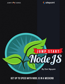

mate```
Roberto Nogueira  BSd EE, MSd CE
Solution Integrator Experienced - Certified by Ericsson
```

# Jumpstart Node.js



## Contents

```
Table of Contents

 [x] Preface 
 [x] Who Should Read This Book
 [x] What’s in This Book
 [x] Where to Find Help 
 [x] The SitePoint Forums 
 [x] The Book’s Website 
 [x] The SitePoint Newsletters 
 [x] Your Feedback 
 [x] Friends of SitePoint 
 [x] Online Quiz 
 [x] Acknowledgments 
 [x] Conventions Used in This Book 
 [x] Code Samples 
 [x] Tips, Notes, and Warnings 

Chapter 1 Coming to a Server Near You 
[x] Why Node.js? 
[x] Strengths and Weaknesses 
[x] In the Beginning 
[x] Installation 
[x] Assembling the Pieces 
[ ] A Basic Form 
[ ] The Database 
[ ] Summary 

Chapter 2 Let’s Get Functional 
[ ] Introduction 
[ ] Always Be Testing 
[ ] Building the Exchange 
[ ] The Heart of the Engine 
[ ] The Meat of the Problem 
[ ] The Logical Core 
[ ] A Little More Action 
[ ] What about the real thing?
[ ] Summary 

Chapter 3 Persistence Pays 
[ ] Why MongoDB?
[ ] Installation 
[ ] Choosing the Driver
[ ] A Quick Test 
[ ] Creating the Wrapper 
[ ] Finding Data 
[ ] Inserting Data 
[ ] Storing the Data 
[ ] Before Express
[ ] Building an API 
[ ] Charting the Result 
[ ] Summary

Chapter 4 Beautifying with Bootstrap 
[ ] Introduction 
[ ] Sign Up, Sign In
[ ] A New User 
[ ] There Can Be Only One 
[ ] Authentication 
[ ] A Basic Portfolio 
[ ] Bootstrap Widgets 
[ ] Password Protection 
[ ] Summary 

Chapter 5 The Real-time Web 
[ ] Let’s Chat 
[ ] Chat Tab Connecting Express with Socket.IO 
[ ] Client Chat Code 
[ ] Who has joined? 
[ ] Let Them Speak 
[ ] Who’s online? 
[ ] Real-time Trades 
[ ] Trades on the Client 
[ ] Forms Begone 
[ ] Summary

Chapter 6 Backbone 
[ ] Models, Views, Controllers, and Backbone.js 
[ ] Sneak Preview
[ ] Client Filtering 
[ ] A Backbone Model 
[ ] From Model to View
[ ] Client Filters 
[ ] Real-time Trades
[ ] Loading Trade Data 
[ ] Your Very Own Market 
[ ] Summary 

Chapter 7 Production 
[ ] Development versus Production 
[ ] 404 Not Found 
[ ] Hosting Options 
[ ] Run It Forever 
[ ] Summary 
[ ] Further Resources 
```
